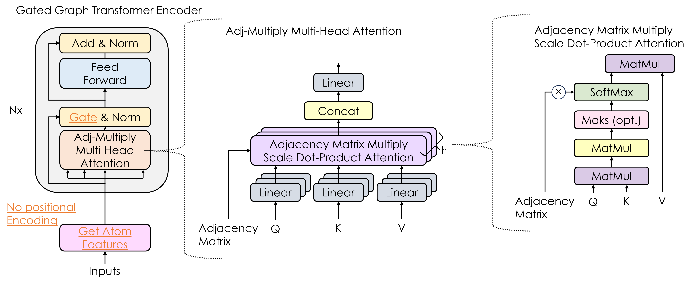

# Gated Graph Transformer Ensemble Model : Modified Transformer based Property Prediction Model for Chemical Structures

*Chiaki Nakamori* & *Tore Eriksson*

## Training
```
python train_ensemble.py --df training_data_file_path
```

## Architecture
#### Inputs


#### Encoder


#### Ensemble

