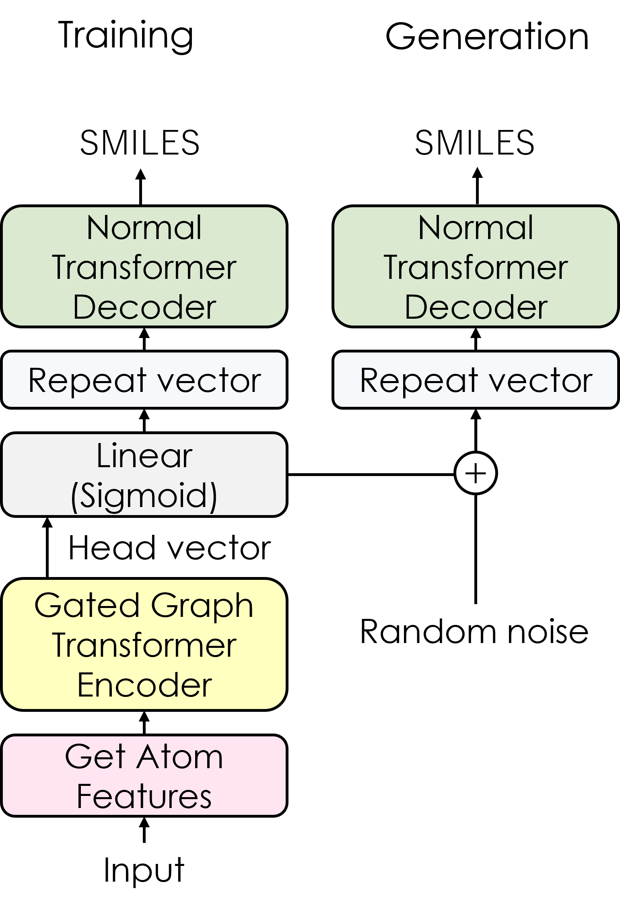

# FragmentAE

*Chiaki Nakamori* & *Tore Eriksson*

## Training
```
python train_FragmentAE.py --df training_data --save save_weights_folder --gpu gpu_number  
```

## Generation
The Python code for generation is not prepared now.
To wirte python code like the following is needed.

```
from  FragmentAPI import get_model, get_fragments

transformer = get_model(f"{save_weights_folder}/weigts_file")
fragment_smiles = get_fragments(source_smiles)
```

## Architecture
### Inputs


### Encoder


### FragmentAE

