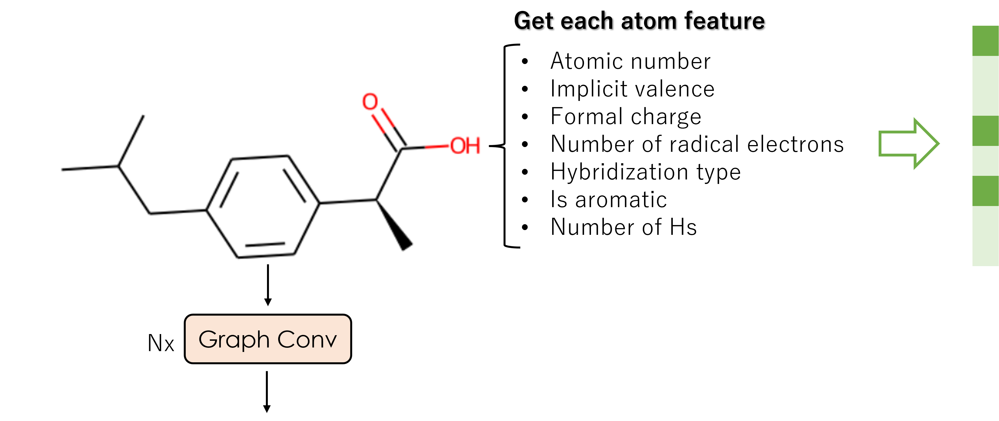
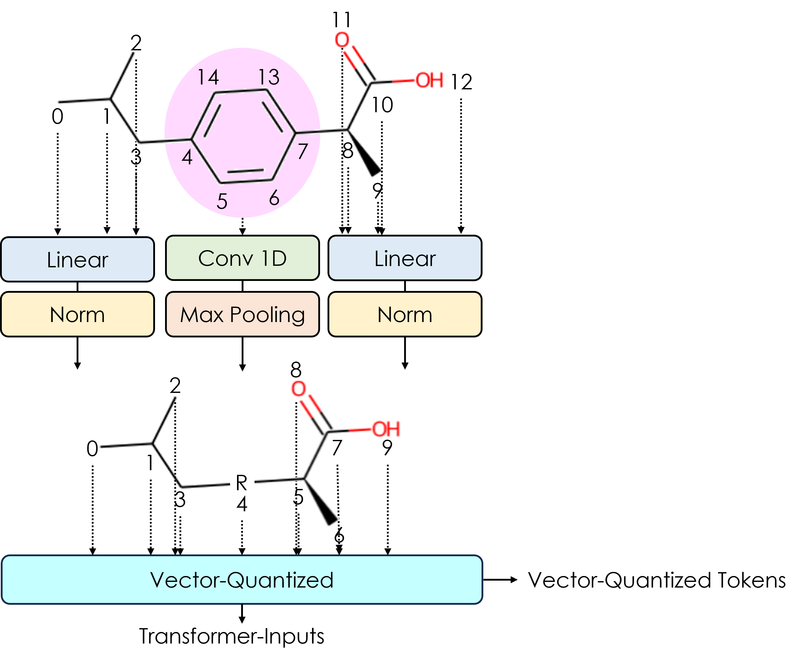
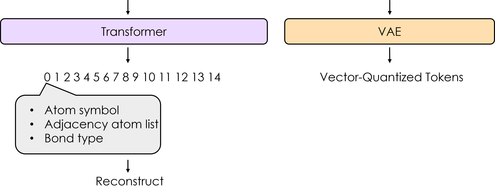
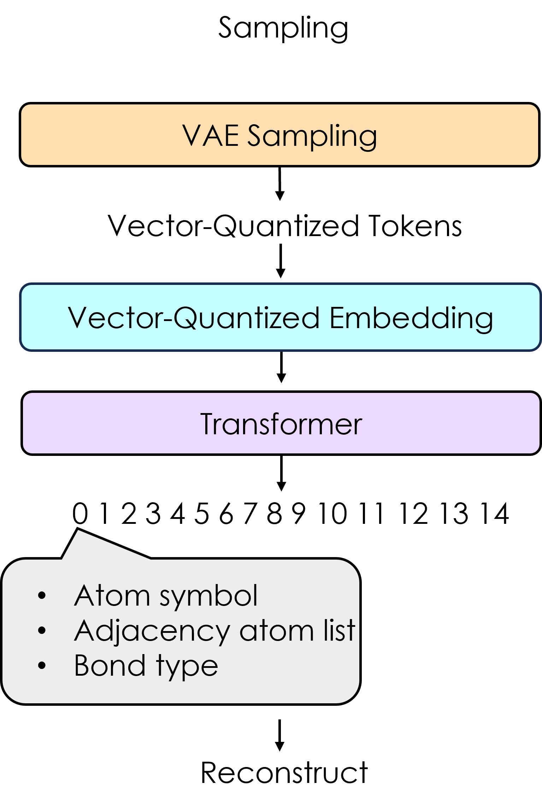

# VQVAE-Chem : Graph-based molecular generative model

*Chiaki Nakamori* & *Tore Eriksson*

This model converts a ring (aromatic ring or aliphatic ring) into one token to simplify the complex graph of a compound and make it easier to learn for AI. 

## Training
```
python train_VQVAE.py --df training_data --save save_weights_folder --gpu gpu_number  
```

## Generation
```
from VQVAEChemGen import VQVAEGen

chemgen = VQVAEGen(f"{save_weights_folder}/VQVAE"))
mols, indices = chemgen.input_smiles_base_sampling(smiles, n = 200, e = 0.32)
```

## Architecture
### 1) Training




### 2) Generation

